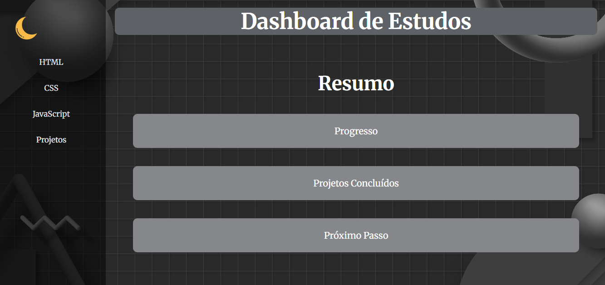

# Dashboard de Estudos

## Sobre o Projeto
O Dashboard de Estudos é um projeto desenvolvido com foco na construção de layouts modernos utilizando **CSS Grid**. A proposta foi aplicar conceitos de estilização bidimensional, organização estrutural e responsividade.

---

## Tecnologias Utilizadas
- HTML5  
- CSS3  

---

## Funcionalidades
- Estrutura semântica organizada (`header`, `aside`, `section`, `footer`)
- Layout bidimensional utilizando `display: grid`
- Interações com pseudo-classe `:hover`
- Adaptação para dispositivos móveis com `@media`
- Organização visual baseada em frações (`fr`) e áreas do Grid

---

## Objetivo
Aprofundar os fundamentos de CSS Grid, consolidar conceitos de layout e evoluir na construção de interfaces estruturadas e responsivas.

---

## Como Executar
1. Clone este repositório:

git clone 

2. Abra o arquivo `index.html` no navegador.

---

## Preview

